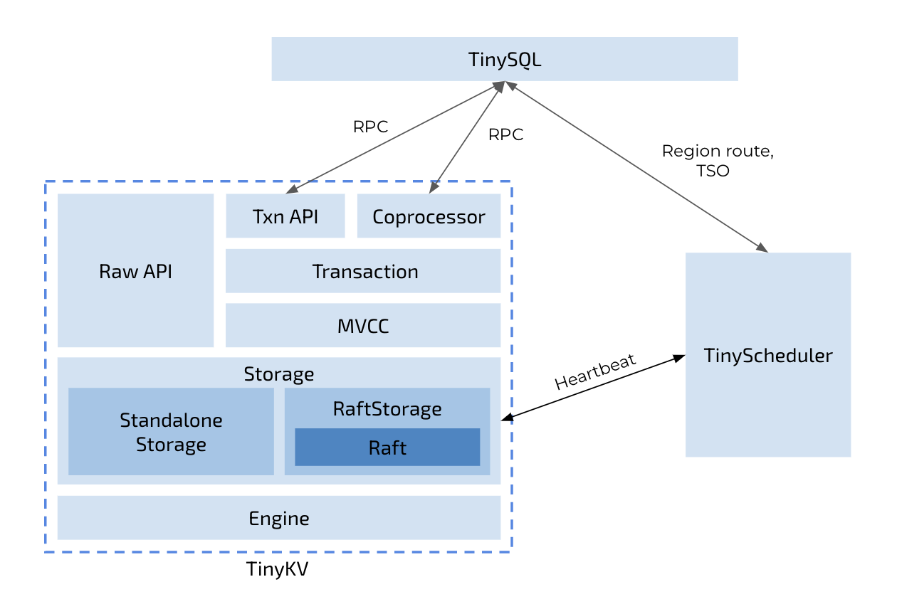

# The TinyKV Course

The TinyKV course builds a key-value storage system with the Raft consensus algorithm. It is inspired by [MIT 6.824](https://pdos.csail.mit.edu/6.824/) and [TiKV Project](https://github.com/tikv/tikv).

After completing this course, you will have the knowledge to implement a horizontally scalable, highly available, key-value storage service with distributed transaction support. Also, you will have a better understanding of TiKV architecture and implementation.

## Course Architecture

The whole project is a skeleton code for a key-value server and a scheduler server at the beginning - you need to finish the core logic step by step:

* [Standalone KV](doc/project1-StandaloneKV.md)
  * Implement a standalone storage engine.
  * Implement raw key-value service handlers.
* [Raft KV](doc/project2-RaftKV.md)
  * Implement the basic Raft algorithm.
  * Build a fault-tolerant KV server on top of Raft.
  * Add the support of Raft log garbage collection and snapshot.
* [Multi-raft KV](doc/project3-MultiRaftKV.md)
  * Implement membership change and leadership change to Raft algorithm.
  * Implement conf change and region split on Raft store.
  * Implement a basic scheduler.
* [Transaction](doc/project4-Transaction.md)
  * Implement the multi-version concurrency control layer.
  * Implement handlers of `KvGet`, `KvPrewrite`, and `KvCommit` requests.
  * Implement handlers of `KvScan`, `KvCheckTxnStatus`, `KvBatchRollback`, and `KvResolveLock` requests.

## Code Structure



Similar to the architecture of TiDB + TiKV + PD that separates the storage and computation, TinyKV only focuses on the storage layer of a distributed database system. If you are also interested in the SQL layer, please see [TinySQL](https://github.com/tidb-incubator/tinysql). Besides that, there is a component called TinyScheduler acting as a center control of the whole TinyKV cluster, which collects information from the heartbeats of TinyKV. After that, the TinyScheduler can generate scheduling tasks and distribute the tasks to the TinyKV instances. All of instances are communicated via RPC.

The whole project is organized into the following directories:

* `kv` contains the implementation of the key-value store.
* `raft` contains the implementation of the Raft consensus algorithm.
* `scheduler` contains the implementation of the TinyScheduler, which is responsible for managing TinyKV nodes and generating timestamps.
* `proto` contains the implementation of all communication between nodes and processes uses Protocol Buffers over gRPC. This package contains the protocol definitions used by TinyKV, and the generated Go code that you can use.
* `log` contains utility to output log based on level.

## Reading List

We provide a [reading list](doc/reading_list.md) for the knowledge of distributed storage system. Though not all of them are highly related with this course, they can help you construct the knowledge system in this field.

Also, you're encouraged to read the overview of TiKV's and PD's design to get a general impression on what you will build:

* TiKV, the design of data storage ([English](https://en.pingcap.com/blog/tidb-internal-data-storage), [Chinese](https://pingcap.com/zh/blog/tidb-internal-1)).
* PD, the design of scheduling ([English](https://en.pingcap.com/blog/tidb-internal-scheduling), [Chinese](https://pingcap.com/zh/blog/tidb-internal-3)).

## Build TinyKV from Source

### Prerequisites

* `git`: The source code of TinyKV is hosted on GitHub as a git repository. To work with git repository, please [install `git`](https://git-scm.com/downloads).
* `go`: TinyKV is a Go project. To build TinyKV from source, please [install `go`](https://golang.org/doc/install) with version greater or equal to 1.13.

### Clone

Clone the source code to your development machine.

```bash
git clone https://github.com/tidb-incubator/tinykv.git
```

### Build

Build TinyKV from the source code.

```bash
cd tinykv
make
```

It builds the binary of `tinykv-server` and `tinyscheduler-server` to `bin` dir.

## Run TinyKV with TinySQL

1. Get `tinysql-server` follow [its document](https://github.com/tidb-incubator/tinysql#deploy).
2. Put the binary of `tinyscheduler-server`, `tinykv-server` and `tinysql-server` into a single dir.
3. Under the binary dir, run the following commands:

```bash
mkdir -p data
./tinyscheduler-server
./tinykv-server -path=data
./tinysql-server --store=tikv --path="127.0.0.1:2379"
```

Now you can connect to the database with an official MySQL client:

```bash
mysql -u root -h 127.0.0.1 -P 4000
```
## Autograding and certification

Since Jun 2022, we start using [github classroom](https://github.com/talent-plan/tinysql/blob/course/classroom.md) to accept labs and provide autograding timely. The github classroom invitation is https://classroom.github.com/a/cdlNNrFU. The discussion Wechat/Slack group and the certification after you pass the class is provided in the [tinyKV learning class](https://talentplan.edu.pingcap.com/catalog/info/id:263)


Autograding is a workflow which can automatically run test cases and give feedback timely. However there are some limitations in Github classroom, in order to make golang work and run it in our self-hosted machines, **you need to overwrite the workflow generated by Github classroom and commit it**.

```sh
cp scripts/classroom.yml .github/workflows/classroom.yml
git add .github
git commit -m"update github classroom workflow"
```

## Contributing

Any feedback and contribution is greatly appreciated. Please see [issues](https://github.com/tidb-incubator/tinykv/issues) if you want to join in the development.
# tinykv
